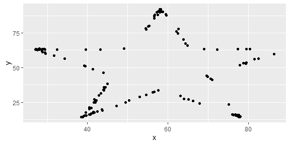
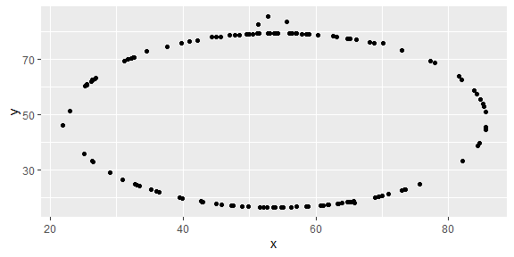
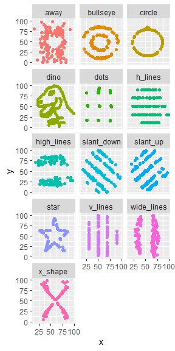

Lab 01 - Hello R
================
zheqi
1/13/2023

## Load packages and data

``` r
library(tidyverse) 
library(datasauRus)
```

## Exercises

### Exercise 1

A data frame with 1846 rows and 3 variables.

### Exercise 2

dino_data \<- datasaurus_dozen %\>% + filter(dataset == “dino”) \>
ggplot(data = dino_data, mapping = aes(x = x, y = y)) + + geom_point()
\> dino_data %\>% + summarize(r = cor(x, y)) \# A tibble: 1 × 1 r <dbl>
1 -0.0645 \> \#\> \# A tibble: 1 × 1 \> \#\> r \> \#\> <dbl> \> \#\> 1
-0.0645 First let’s plot the data in the dino dataset:

``` r
dino_data <- datasaurus_dozen %>%
  filter(dataset == "dino")
ggplot(data = dino_data, mapping = aes(x = x, y = y)) +
  geom_point()
```

<!-- -->

``` r
dino_data %>%
  summarize(r = cor(x, y))
```

    ## # A tibble: 1 × 1
    ##         r
    ##     <dbl>
    ## 1 -0.0645

### Exercise 3

star_data \<- datasaurus_dozen %\>% + filter(dataset == “star”) \>
ggplot(data=star_data, mapping = aes(x = x, y = y))+ + geom_point() \>
star_data %\>% + summarize(r = cor(x, y)) \# A tibble: 1 × 1 r <dbl> 1
-0.0630

``` r
star_data <- datasaurus_dozen %>%
   filter(dataset == "star")
ggplot(data=star_data, mapping = aes(x = x, y = y))+
   geom_point()
```

<!-- -->

``` r
star_data %>%
  summarize(r = cor(x, y))
```

    ## # A tibble: 1 × 1
    ##         r
    ##     <dbl>
    ## 1 -0.0630

### Exercise 4

circle_data \<- datasaurus_dozen %\>% + filter(dataset == “circle”) \>
ggplot(data = circle_data, mapping = aes(x = x, y = y)) + + geom_point()
\> circle_data %\>% + summarize(r = cor(x,y)) \# A tibble: 1 × 1 r <dbl>
1 -0.0683

``` r
circle_data <- datasaurus_dozen %>%
   filter(dataset == "circle")
ggplot(data=circle_data, mapping = aes(x = x, y = y))+
   geom_point()
```

<!-- -->

``` r
circle_data %>%
  summarize(r = cor(x, y))
```

    ## # A tibble: 1 × 1
    ##         r
    ##     <dbl>
    ## 1 -0.0683

### Exercise 5

``` r
ggplot(datasaurus_dozen, aes(x = x, y = y, color = dataset))+
   geom_point()+
   facet_wrap(~ dataset, ncol = 3) +
   theme(legend.position = "none")
```

<!-- -->

``` r
datasaurus_dozen %>%
   group_by(dataset) %>%
   summarize(r = cor(x, y)) %>%
   print(13)
```

    ## # A tibble:
    ## #   13 × 2
    ##    dataset   
    ##    <chr>     
    ##  1 away      
    ##  2 bullseye  
    ##  3 circle    
    ##  4 dino      
    ##  5 dots      
    ##  6 h_lines   
    ##  7 high_lines
    ##  8 slant_down
    ##  9 slant_up  
    ## 10 star      
    ## 11 v_lines   
    ## 12 wide_lines
    ## 13 x_shape   
    ## # … with 1
    ## #   more
    ## #   variable:
    ## #   r <dbl>

``` r
knitr::opts_chunk$set(echo = TRUE)
```

## Bonus Tips by Yoo Ri

Here are some helpful tips :)

- filter() is for extracting rows

- group_by() is for grouping datasets by assigned column

- ungroup() cancels the grouping

- summarize() is often used with group_by(). This function can print the
  output according to the group_by().

- facet_grid(y\~x,…) creates a grid with variable y as a row, variable x
  as a column  

- facet_wrap(x,… ) is useful when there is only one variable
